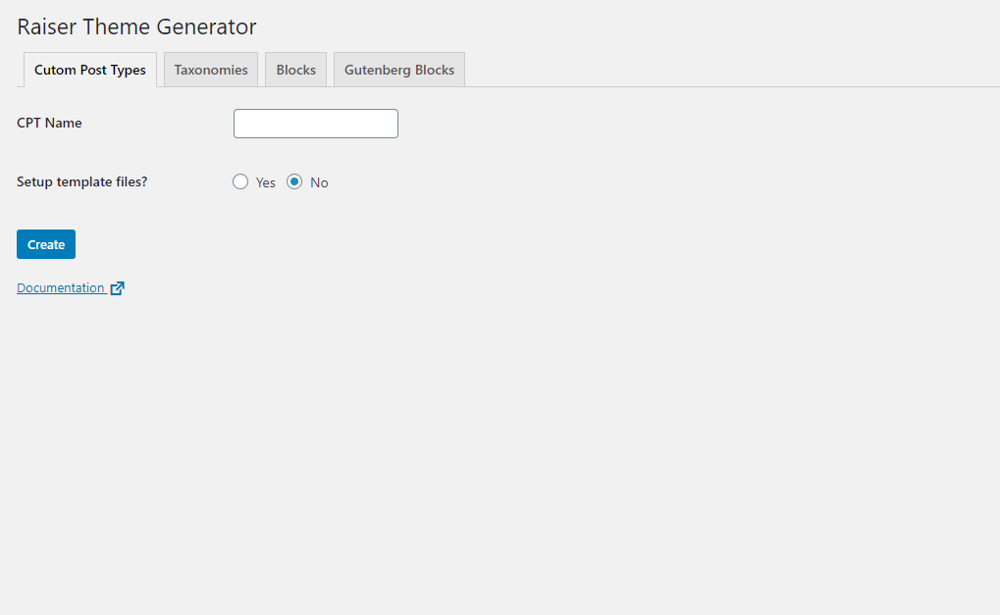

Raiser WP Pro comes with a UI to help you generate your theme files from the admin panel. To find it, go to Tools > Raiser Generator

> Config - ensure you have setup a user to view the menu inside the config/admin.php file

```
/*
|--------------------------------------------------------------------------
| Raiser WP Theme Generator page
|--------------------------------------------------------------------------
|
| Set the usernames of users who can view the theme generator page
|
*/  
'theme_generator_user_logins' => ['admin'],
```

The admin page lets your set up theme files using the tabs, and entering your required data.

